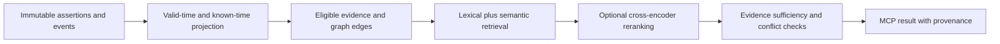

# Architecture decisions after the first two experiments

## Separate the questions a retriever answers

A vector score estimates semantic relevance. A temporal projection determines whether evidence was available and applicable at the requested coordinates. A canonical policy decides which claims an organization accepts, potentially retaining disagreement. An evidence sufficiency decision determines whether retrieved passages support answering this question. None of these decisions replaces the others.

## Scale without losing historical evidence

The shipped SQLite derived vector store is the exact correctness reference. It keys vectors by model identity and exact projected text; it is not yet a temporal ANN service.

A future scalable implementation can materialize evidence-text versions with half-open knowledge intervals. Every newly visible evidence passage starts a new text version. Lifecycle events also define valid/known eligibility boundaries. This allows vector records to carry explicit version identity and coordinate intervals instead of mutating one current vector and accidentally losing past views. It requires careful interval splitting for late corrections; a simple active boolean cannot answer historical knowledge queries.

For larger corpora, evaluate pgvector or a vector service supporting payload prefilters. Keep an exact scoped-search fallback and measure candidate recall against it. Reranking after a small unfiltered candidate pool cannot recover relevant evidence that was never retrieved. Graph expansion must apply the same coordinate checks at each hop.

## The next theory test

Use an independently authored benchmark containing questions whose answers require two or more temporally compatible supporting facts. Compare the same embedding model and candidate budget under lexical/vector only, graph expansion, temporal filters, and graph plus temporal filters. Include contradictory sources, late corrections, no-answer questions and a shared answer generator only in a separately budgeted answer-quality track. Report context validity and evidence coverage before evaluating generated answers.

The round-two synthetic diagnostic has harder paraphrases and boundaries but is not a multi-hop benchmark. Its stronger filtered baselines sometimes beat Chronoverse. That counterevidence motivates this controlled ablation instead of attributing every ranking improvement to the graph/time architecture.

## Product choices

- Keep broad retrieval as the default until a sufficiency policy is validated on representative user documents. An eventual precise mode should expose reduced coverage and distinguish no supporting evidence from a false claim.
- Choose embeddings by cross-domain results and language needs. BGE-small English performance does not establish Thai retrieval quality. Absolute score cutoffs must be calibrated for each model/runtime rather than copied from MiniLM.
- Use persistent vectors before adding distributed caching. Add Redis when measured multi-worker sharing or repeated projection work justifies it; include profile, coordinates, model and ledger revision in any projection-cache key.
- Preserve competing scientific theories with their applicability domains and sources. Retirement describes an assertion lifecycle; it must not imply that an older approximation was useless or that a historically believed claim was physically true.

## Public temporal benchmark candidates researched, not run

[MultiTQ](https://github.com/czy1999/MultiTQ) provides temporal knowledge-graph questions at multiple time granularities. [MusTQ](https://aclanthology.org/2024.findings-acl.696/) targets multi-step temporal reasoning. They are stronger candidates for a graph/time ablation than treating SciFact as a temporal benchmark. Their answer labels are not document-relevance judgments: a rigorous adapter needs explicit entity/answer mapping, a fixed query planning strategy and an answer-level scoring protocol. Their valid-time facts also do not automatically supply an independent knowledge-time/late-correction benchmark. No results for these datasets are claimed in round two.
